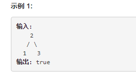
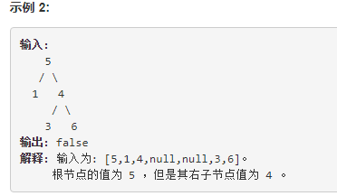

<h3>98. 验证二叉搜索树:</h3>
给定一个二叉树，判断其是否是一个有效的二叉搜索树。

一个二叉搜索树具有如下特征：
<ul>
    <li>节点的左子树只包含小于当前节点的数。</li>
    <li>节点的右子树只包含大于当前节点的数。</li>
    <li>所有左子树和右子树自身必须也是二叉搜索树。</li>
</ul>

<h3>eg:</h3>

<h3>思路:</h3>

根据二叉搜索树的特征来实现，
设定一个最大，一个最小两个临界值，
保证它的左子树小于根节点，右子树小于大于它的根节点即可。

对于根节点不用定位界，所以是无穷小到无穷大。

接下来当我们往左边走时，上界就变成当前节点的值，下届不变

往右边走时，下届就变成当前结点值，上界不变。

如果再递归中遇到结点值超越了自己的上下界，则返回false,否则返回左右子树的结果。
